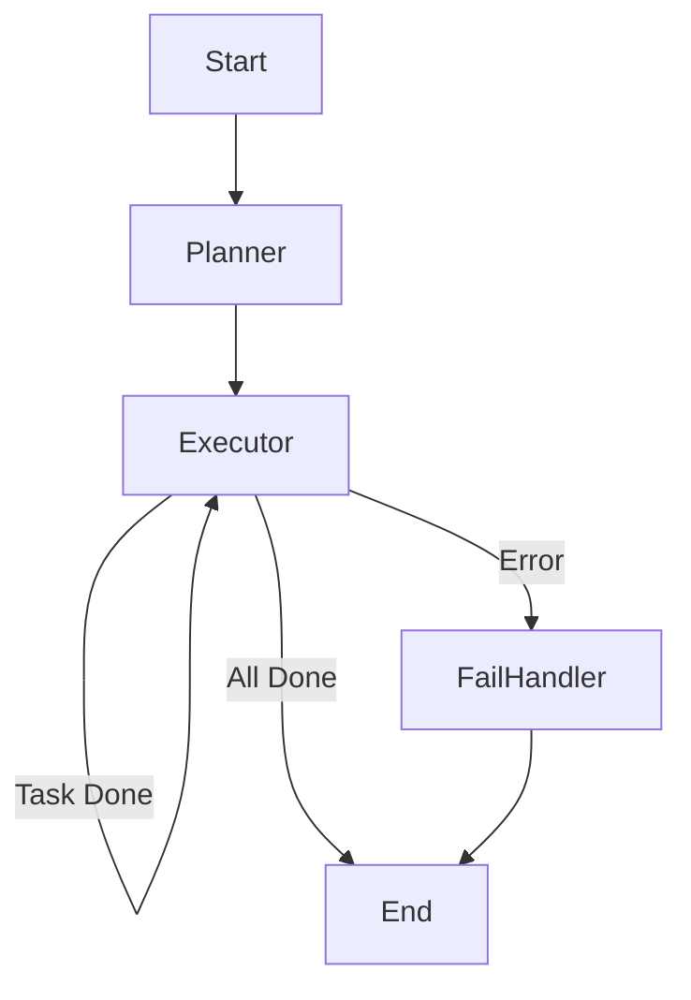

# LangGraph Architecture

The Angular Upgrade Agent now uses [LangGraph](https://langchain-ai.github.io/langgraphjs/) for orchestration. This moves us from a procedural DAG execution to a state-machine based architecture, enabling more robust cycles (e.g., self-healing loops) and clearer state management.

## State Schema (`state.ts`)

The `UpgradeState` interface tracks:
- **Phase**: Current high-level status (`PLANNING`, `EXECUTION`, etc.)
- **Tasks**: List of all upgrade tasks.
- **Context**: Project details (`AgentContext`).
- **Error**: Structure for error recovery.

## Nodes (`nodes.ts`)

Encapsulates existing agent logic into graph-compatible functions:
- **Planner Node**: Invokes `VersionPlannerAgent` to generate the task list.
- **Executor Node**: Iterates through pending tasks, invoking the appropriate agent (e.g., `DependencyAgent`, `BuildAgent`). Loops back to itself until all tasks are complete.
- **Fail Handler**: Manages critical failures (rollback hooks would go here).

## Workflow (`workflow.ts`)

The graph is defined as `planner -> executor (loop) -> end`.

## Benefits
1. **Cyclic Execution**: Native support for loops (e.g., `BuildAgent` retrying 3 times) without complex recursion in the orchestrator.
2. **State Persistence**: The state object is serializable, making it easier to pause/resume upgrades in the future.
3. **Observability**: Each step transition is a clear event.
